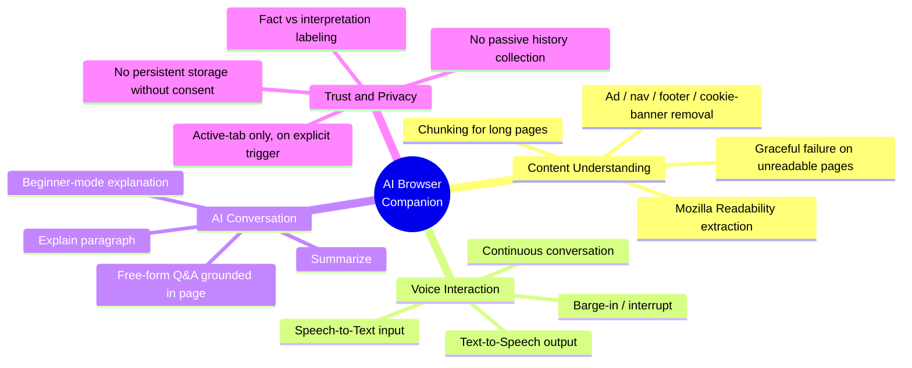
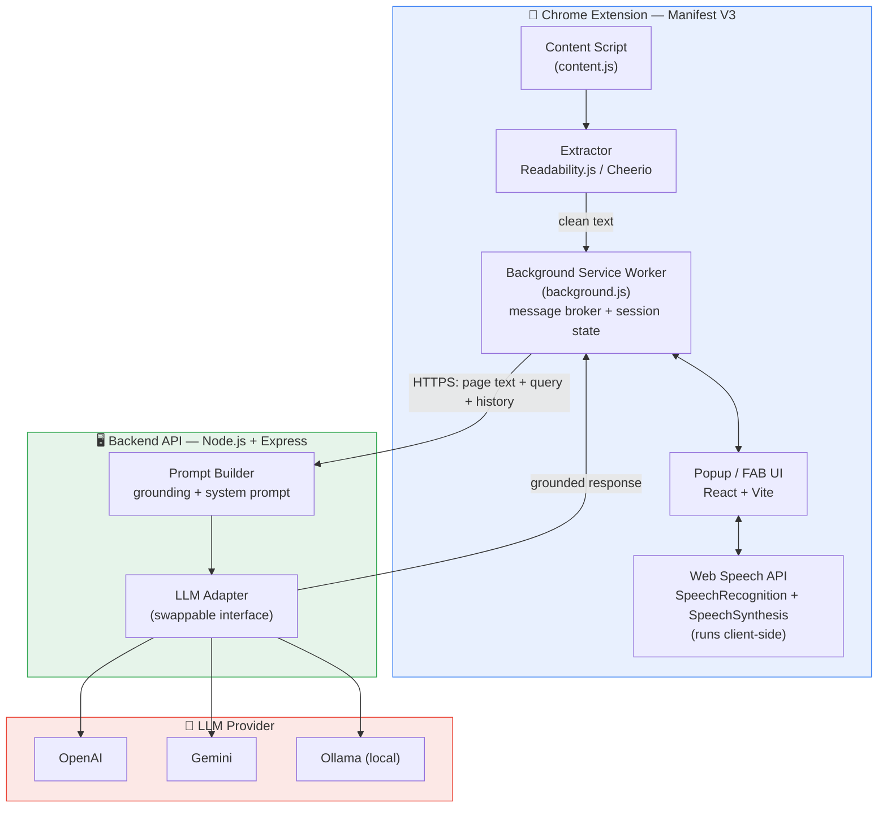
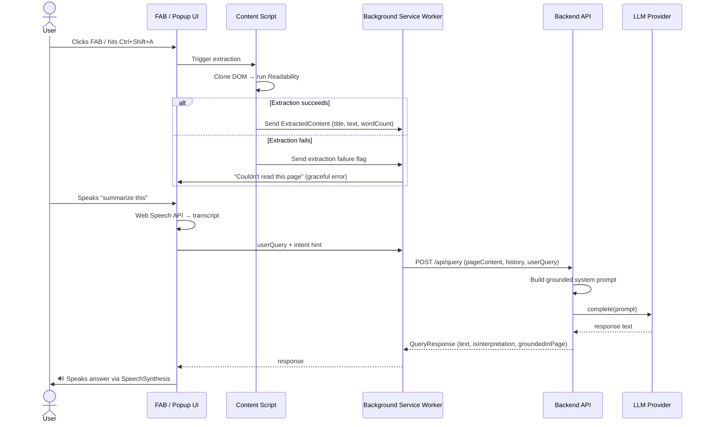
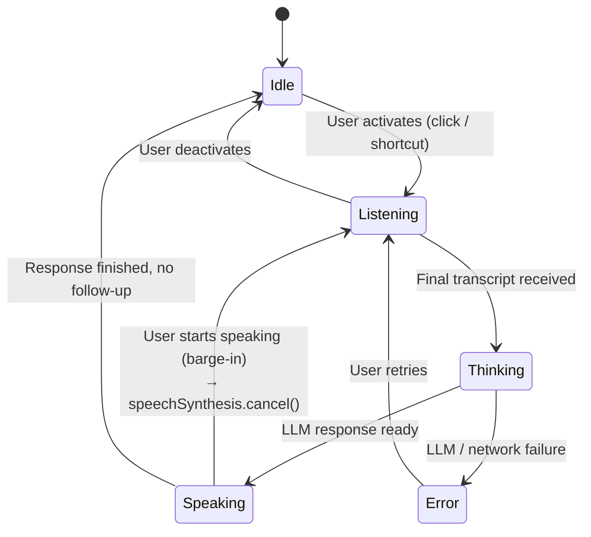
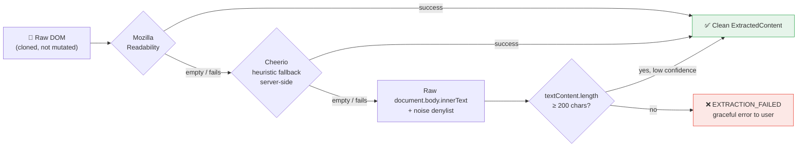

<div align="center">

# 🎙️ AI Browser Companion

### An intelligent browser assistant that reads, understands, and talks about any webpage — without you ever leaving the page.

**Team: Run Time Error**
**Track:** Track 4 — AI Browser Companion
**Build Window:** 15 Hours · 4 Team Members · ~45–60 Person-Hours


</div>

---

## 📌 Table of Contents

1. [Overview](#-overview)
2. [Problem Statement](#-problem-statement)
3. [Goals & Success Metrics](#-goals--success-metrics)
4. [Target Users](#-target-users--use-cases)
5. [Core Features](#-core-features)
6. [System Architecture](#-system-architecture)
7. [How It Works (Data Flow)](#-how-it-works-data-flow)
8. [Voice Interaction Flow](#-voice-interaction-flow)
9. [Tech Stack](#-tech-stack)
10. [Content Extraction Pipeline](#-content-extraction-pipeline)
11. [Intent Classification](#-intent-classification)
12. [API Contract](#-api-contract)
13. [Data Models](#-data-models)
14. [Error Handling](#-error-handling)
15. [Privacy & Ground Rules](#-privacy--ground-rules)
16. [Project Structure](#-project-structure)
17. [Team & Roles](#-team--roles)
18. [Build Timeline](#-build-timeline-15-hour-plan)
19. [Judging Criteria Alignment](#-judging-criteria-alignment)
20. [Stretch Goals](#-stretch-goals)
21. [Risks & Mitigations](#-risks--mitigations)
22. [Getting Started](#-getting-started)
23. [The Final Challenge](#-the-final-challenge)

---

## 🧭 Overview

**AI Browser Companion** is a Chrome Extension that lets users **understand, listen to, and converse about any webpage** — without copying content into a separate chatbot. Users click a floating button (or hit a keyboard shortcut), speak naturally, and the assistant reads, summarizes, and answers questions grounded strictly in the content of the currently open page.

> **This is not a chatbot.** It is a context-locked reading companion that lives *inside* the browser.

The value proposition is simple: it collapses the friction of **"copy → switch tab → paste → ask → switch back"** into a single, natural, in-page voice interaction.

---

## ❓ Problem Statement

People consume large volumes of long-form content every day — articles, docs, research papers, reviews, tutorials. Existing AI chatbots break the reading flow by requiring manual copy-paste and context re-establishment. This is especially painful for:

- 🏃 Users who prefer **listening** over reading (commuters, multitaskers)
- 📚 Users skimming **long technical documentation**
- ⏱️ Users who want a **quick summary** before committing time to a full article
- ♿ Users with **accessibility needs** (visual fatigue, dyslexia, etc.)

> **Core question the product must answer:** Can a user understand an unfamiliar webpage — including one the assistant has never seen before — purely through voice, without ever leaving the tab?

---

## 🎯 Goals & Success Metrics

| Goal | Metric | Target (Hackathon Demo) |
|---|---|---|
| Accurate content understanding | % of extracted content that is "meaningful" (article body, not chrome/ads/nav) | ≥ 90% on test sites |
| Reduced effort to consume info | Time from page load to first spoken summary | ≤ 10 seconds |
| Natural voice interaction | Assistant handles interrupt + follow-up without restart | Works reliably in live demo |
| Generalization | Works on a webpage never seen before, unmodified code | Passes judges' **Final Challenge** |
| Groundedness | Assistant does not hallucinate facts not present on page | 0 fabricated claims in demo run |

**Non-goals for this hackathon:** general web search unrelated to the page, multi-tab/cross-page reasoning, persistent cloud accounts, mobile browser support (Chrome desktop only).

---

## 👥 Target Users & Use Cases

| Persona | Need |
|---|---|
| 🏃 **The Skimmer** | Wants a 2-minute summary before deciding whether to read the full article |
| 🎧 **The Multitasker** | Wants to listen to an article hands-free while doing something else |
| 🔬 **The Researcher** | Reading dense docs/papers, wants clarifications without breaking focus |
| ♿ **The Accessibility User** | Relies on audio consumption due to visual fatigue, dyslexia, or similar needs |

**Core user stories:**
- "As a user, I want to click one button and have the page read aloud."
- "As a user, I want to say *'summarize this'* and get a spoken summary grounded in the page."
- "As a user, I want to interrupt the assistant mid-sentence and ask a follow-up."
- "As a user, I want to ask *'explain this like I'm a beginner'* and get a simplified answer."
- "As a user, I want to be told clearly when the page can't be read — not fail silently."
- "As a user, I want assurance my browsing data isn't stored without consent."

---

## ✨ Core Features



---

## 🏗️ System Architecture

The system is composed of **three deployable units**: the Chrome Extension (client), a stateless Backend API, and a swappable LLM Provider.



---

## 🔄 How It Works (Data Flow)



---

## 🎙️ Voice Interaction Flow

The voice pipeline is designed around **five UI states**, with barge-in (interrupt) handled as a first-class flow, not an afterthought.



**Key design decision:** while `speechSynthesis.speaking === true`, `SpeechRecognition` keeps listening in a low-sensitivity mode. The instant user speech is detected, TTS is cancelled and the UI flips to `Listening` — this is the trickiest browser-API interaction and is tested early in the build, not left to the end.

---

## 🛠️ Tech Stack

| Layer | Technology | Purpose |
|---|---|---|
| **Extension Platform** | Chrome Extension, Manifest V3 | Browser integration, content script injection |
| **Content Extraction** | Mozilla Readability, Cheerio (fallback), custom DOM heuristics | Clean article-text extraction |
| **Frontend** | React + Vite | Popup/sidebar UI, conversation history, controls |
| **Voice** | Web Speech API (`SpeechRecognition`, `SpeechSynthesis`) | STT input / TTS output, fully client-side |
| **Backend** | Node.js + Express | Stateless API, prompt construction, LLM proxy |
| **AI** | OpenAI / Gemini (primary) · Ollama + Llama/Gemma (optional local/offline) | Summarization, Q&A, explanation |
| **Hosting** | Local for demo, or Render / Railway / Fly.io | Backend deployment if remote access is needed |

---

## 🔍 Content Extraction Pipeline

Extraction runs through a **layered fallback pipeline** — first success wins — so the assistant generalizes to webpages it has never seen (critical for the Final Challenge).



**Noise denylist applied at every stage:**
```
nav, footer, aside, header[role=banner],
[class*="cookie"], [id*="cookie"],
[class*="advert"], [class*="ads-"], [id*="ad-"],
[class*="sidebar"], [aria-hidden="true"],
script, style, noscript, iframe
```

**Site-specific handling (stretch, P1):**

| Site Type | Target Selector |
|---|---|
| GitHub README | `article.markdown-body` |
| Wikipedia | `#mw-content-text` (optionally strip `.navbox`, `.infobox`) |
| Medium / Dev.to | Readability generally sufficient; fallback only on paywall wrapper detection |

**Chunking for token limits:**
- Pages > ~3,000 words → split into ~1,500-word chunks with 100-word overlap
- `SUMMARIZE` intent → map-reduce (summarize each chunk → summarize the summaries)
- `Q&A` intent → cheap keyword/heading-based retrieval selects the most relevant chunk (no vector DB needed at hackathon scope)

---

## 🧠 Intent Classification

A **lightweight, rule-based intent classifier** runs client-side so obvious commands don't cost an LLM round trip — this keeps the demo feeling instant for control-flow commands, while generation-heavy commands get a short "thinking" state.

| User Says | Intent | LLM Call? | Handling |
|---|---|:---:|---|
| "read this page" / "read it" | `READ_ALOUD` | ❌ | TTS reads `textContent` directly, sentence-chunked |
| "summarize this" / "two-minute summary" | `SUMMARIZE` | ✅ | Summarization prompt template |
| "explain this paragraph" / "what does this mean" | `EXPLAIN` | ✅ | Includes highlighted/last-read paragraph as focused context |
| "explain like I'm a beginner" | `EXPLAIN_SIMPLE` | ✅ | Simplified-register system prompt variant |
| "give me an example" | `EXAMPLE` | ✅ | Generates an illustrative example grounded in the page topic |
| "repeat that" | `REPEAT` | ❌ | Replays last TTS utterance from local buffer |
| "continue" | `CONTINUE` | ❌ | Resumes `READ_ALOUD` from last sentence index |
| "skip this section" | `SKIP` | ❌ | Advances reading cursor past current heading boundary |
| anything else | `FREEFORM_QA` | ✅ | Standard grounded Q&A prompt |

---

## 📡 API Contract

### `POST /api/query`

**Request:**
```json
{
  "pageContent": { "...ExtractedContent" },
  "history": [ { "...ChatTurn" } ],
  "userQuery": "explain this like I'm a beginner",
  "intent": "EXPLAIN_SIMPLE"
}
```

**Response `200 OK`:**
```json
{
  "text": "In simple terms, this paragraph is saying...",
  "isInterpretation": true,
  "groundedInPage": true
}
```

**Response `422 Unprocessable`:**
```json
{
  "error": {
    "code": "CONTENT_TOO_LARGE",
    "message": "This page's content is unusually long — I've summarized the first section. Ask me to continue for more."
  }
}
```

### Other Endpoints

| Endpoint | Purpose |
|---|---|
| `POST /api/summarize` | Dedicated map-reduce summarization path, optimized/cached independently |
| `GET /api/health` | Liveness check — shows "backend unreachable" instead of hanging silently |

---

## 🗂️ Data Models

<table>
<tr><td>

**ExtractedContent**
```ts
interface ExtractedContent {
  url: string;
  title: string;
  textContent: string;
  byline?: string;
  siteName?: string;
  wordCount: number;
  extractionMethod:
    "readability" |
    "cheerio-fallback" |
    "raw-dom";
  truncated: boolean;
}
```

</td><td>

**ChatTurn**
```ts
interface ChatTurn {
  role: "user" | "assistant";
  content: string;
  timestamp: number;
  isInterpretation?: boolean;
}
```

</td></tr>
<tr><td>

**QueryRequest**
```ts
interface QueryRequest {
  pageContent: ExtractedContent;
  history: ChatTurn[];
  userQuery: string;
  intent?: IntentHint;
}
```

</td><td>

**QueryResponse**
```ts
interface QueryResponse {
  text: string;
  isInterpretation: boolean;
  groundedInPage: boolean;
  error?: {
    code: "EXTRACTION_FAILED" |
      "CONTENT_TOO_LARGE" |
      "LLM_ERROR" | "NO_CONTENT";
    message: string;
  };
}
```

</td></tr>
</table>

**LLM Adapter interface** (swappable — provider selected via `LLM_PROVIDER` env var):
```ts
interface LLMAdapter {
  complete(params: {
    systemPrompt: string;
    pageContent: string;
    history: ChatTurn[];
    userQuery: string;
  }): Promise<{ text: string; isInterpretation: boolean }>;
}
```
Implementations: `OpenAIAdapter`, `GeminiAdapter`, `OllamaAdapter`.

---

## 🚨 Error Handling

| Failure | Detection Point | User-Facing Behavior |
|---|---|---|
| Extraction yields < 200 chars | Client, post-extraction | "I couldn't read this page's content — it might be behind a login or built in a way I can't parse yet." |
| Mic permission denied | Client, `SpeechRecognition` error | Falls back to a text-input box; shows one-time enable-mic instructions |
| Backend unreachable | `/api/health` fails or fetch times out (> 8s) | "I'm having trouble reaching the AI service — try again in a moment." No infinite spinner |
| LLM returns empty/error | Backend adapter throws | Generic retry message to client; full error logged server-side only |
| Content exceeds token budget | Backend pre-flight estimate | Auto-chunk + map-reduce; user is always told, never silently truncated |
| Answer not grounded in page | LLM response parsing (`groundedInPage: false`) | Prefixed verbally: "I don't see that in this page, but..." |

---

## 🔐 Privacy & Ground Rules

These are **non-negotiable** requirements baked into the architecture, not just application logic:

- ✅ Only the **currently active tab** is processed, and only on **explicit user trigger** — no passive/background scraping
- ✅ **No browsing history** is collected
- ✅ Page content is **not stored** beyond the request unless the user explicitly clicks "save"
- ✅ AI-generated opinions/interpretations are **visibly distinguished** from factual extraction (`isInterpretation` flag)
- ✅ Graceful, explained failure when content can't be extracted — **never silent failure**
- ✅ API keys live only in backend `.env`, **never shipped in the extension bundle**
- ✅ Extracted HTML is sanitized before any `innerHTML` use (XSS prevention)
- ✅ Uses `activeTab` permission (not broad `tabs`) — extension only gets page access on explicit click/shortcut, enforcing "no passive scraping" at the **platform level**

---

## 📁 Project Structure

```
ai-browser-companion/
├── extension/                 # Chrome Extension (Manifest V3)
│   ├── manifest.json
│   ├── background.js          # Service worker — message broker, session state
│   ├── content.js             # DOM access, Readability extraction, FAB injection
│   └── dist/                  # Built React UI, injected into popup/FAB
│
├── ui/                        # React + Vite frontend
│   ├── src/
│   │   ├── components/        # FAB, conversation panel, controls
│   │   ├── hooks/              # useSpeechRecognition, useSpeechSynthesis
│   │   └── state/               # Conversation + session state
│   └── vite.config.js
│
└── server/                    # Node.js + Express backend
    ├── index.js
    ├── routes/
    │   ├── query.js            # POST /api/query
    │   ├── summarize.js        # POST /api/summarize
    │   └── health.js           # GET /api/health
    ├── adapters/
    │   ├── openai.js
    │   ├── gemini.js
    │   └── ollama.js
    └── .env                    # API keys (never committed)
```

---

## 👨‍💻 Team & Roles — **Run Time Error**

| Role | Focus Area |
|---|---|
| 🧩 **Browser & Extension** | Manifest V3 setup, content scripts, DOM extraction pipeline, FAB injection |
| 🤖 **AI & Backend** | Express server, prompt design, LLM adapter integration, summarization/QA logic |
| 🎨 **Frontend** | React popup/sidebar UI, audio controls, conversation history, state indicators |
| 🎙️ **Voice & Integration** | Speech recognition/synthesis, barge-in/interrupt handling, end-to-end integration, demo prep |

---

## ⏱️ Build Timeline (15-Hour Plan)

```mermaid
gantt
    dateFormat  HH:mm
    axisFormat  %H:%M
    section Setup
    Repo + Manifest V3 skeleton, popup renders, Express scaffold   :a1, 00:00, 2h
    section Extraction
    Readability extraction working on 2-3 test sites               :a2, after a1, 3h
    section AI Integration
    LLM integration - summarize + Q&A via text input first         :a3, after a2, 3h
    section Voice
    STT/TTS wired in, FAB fully functional                          :a4, after a3, 2h
    Barge-in, conversation history, error/fallback states            :a5, after a4, 2h
    section Validation
    Cross-site testing (Wikipedia, Medium, Dev.to, GitHub, docs)     :a6, after a5, 1h
    Stretch goals if time allows                                     :a7, after a6, 1h
    Demo rehearsal on unseen page + polish                           :a8, after a7, 1h
```



| Time | Milestone |
|---|---|
| 0–2h | Repo setup, Manifest V3 skeleton, popup renders, Express server scaffolded |
| 2–5h | Content extraction working (Readability) on 2–3 test sites; backend echoes extracted text |
| 5–8h | LLM integration: summarize + Q&A endpoints working via text input first (no voice yet) |
| 8–10h | Voice input/output wired in (STT → backend → TTS); FAB fully functional |
| 10–12h | Interrupt/barge-in, conversation history, error/fallback states |
| 12–13h | Cross-site testing: Wikipedia, Medium, Dev.to, GitHub README, a news site, a doc site |
| 13–14h | Stretch goals if time allows |
| 14–15h | Demo rehearsal on a page not previously tested; bug fixes; polish |

---

## 🏆 Judging Criteria Alignment

| Criterion | How This Project Addresses It |
|---|---|
| **Content Understanding** | Layered extraction pipeline (Readability → Cheerio → raw DOM) + strict grounding prompt |
| **AI Conversation** | Intent-routed responses: summarize, explain, beginner-mode, examples, free-form Q&A — all page-grounded |
| **Voice Experience** | Smooth read-aloud with sentence-level pause/resume and barge-in interrupt support |
| **User Experience** | Clear 5-state UI (Idle/Listening/Thinking/Speaking/Error), unobtrusive FAB, transparent failure handling |
| **Technical Depth** | Manifest V3 architecture, DOM parsing fallback chain, swappable LLM adapter, full-stack integration |
| **Product Thinking** | Solves a real everyday friction point — not just a tech demo — validated against the Final Challenge |

---

## 🌟 Stretch Goals

Priority order, implemented if time permits after MVP is stable:

1. 🖍️ Explain **selected text only** (highlight → ask)
2. 💻 **Code blocks** explained differently from prose (technical tone)
3. 💬 Read only **comments/reviews** (site-specific selectors)
4. 🔖 **Bookmark reading progress** (resume where left off)
5. 🌐 **Translate** the page before reading
6. 🎧 **Podcast-style narration** mode
7. 📝 Save summary to **Notion / Google Docs**, or email it
8. 🕘 **Reading history** (local-only, opt-in)
9. 🗣️ **Multi-language** voice support

---

## ⚠️ Risks & Mitigations

| Risk | Mitigation |
|---|---|
| Extraction fails on unfamiliar/judge-chosen page | Layered fallbacks: Readability → Cheerio heuristics → raw text with noise filters; always show graceful error |
| Web Speech API / mic permission issues during live demo | Test permissions ahead of time; provide text-input fallback path |
| LLM latency during live demo | Use a fast, reliable hosted model; warm up before presenting |
| LLM hallucinating beyond page content | Strict grounding prompt: "only answer from the following content; say so if the answer isn't present" |
| Chrome extension permission/security restrictions | Follow Manifest V3 requirements early; test mic permission flow before demo |
| Judge's page has unusual structure (SPA, paywall, canvas) | Test against diverse site types beforehand; ensure graceful failure messaging works |

---

## 🚀 Getting Started

### Prerequisites
- Node.js ≥ 18
- Google Chrome (latest)
- An OpenAI or Gemini API key (or a local Ollama install for offline mode)

### 1. Clone & install
```bash
git clone <repo-url>
cd ai-browser-companion

# Backend
cd server && npm install

# Frontend
cd ../ui && npm install
```

### 2. Configure environment
```bash
# server/.env
LLM_PROVIDER=openai        # or "gemini" | "ollama"
OPENAI_API_KEY=sk-...
PORT=4000
```

### 3. Run the backend
```bash
cd server && npm run dev
```

### 4. Build the extension UI
```bash
cd ui && npm run build
```

### 5. Load the extension in Chrome
1. Open `chrome://extensions`
2. Enable **Developer mode**
3. Click **Load unpacked** → select the `extension/` folder
4. Pin the extension, open any article, and hit `Ctrl+Shift+A` 🎙️

---

## 🏁 The Final Challenge

> At the end of the hackathon, judges will open a webpage the team has **never seen before**.
> Without modifying any code, the assistant must: **understand it → read it aloud → answer questions → summarize it → hold a conversation about it.**

This requirement drives every architectural decision in this project — from the layered extraction fallback chain, to the strict grounding prompt, to the mandatory cross-site testing pass in the last two hours of the build. If it works on a page we've never tested, the project has done its job.

---

<div align="center">

**Built with 🎙️ by Team Run Time Error**

</div>
